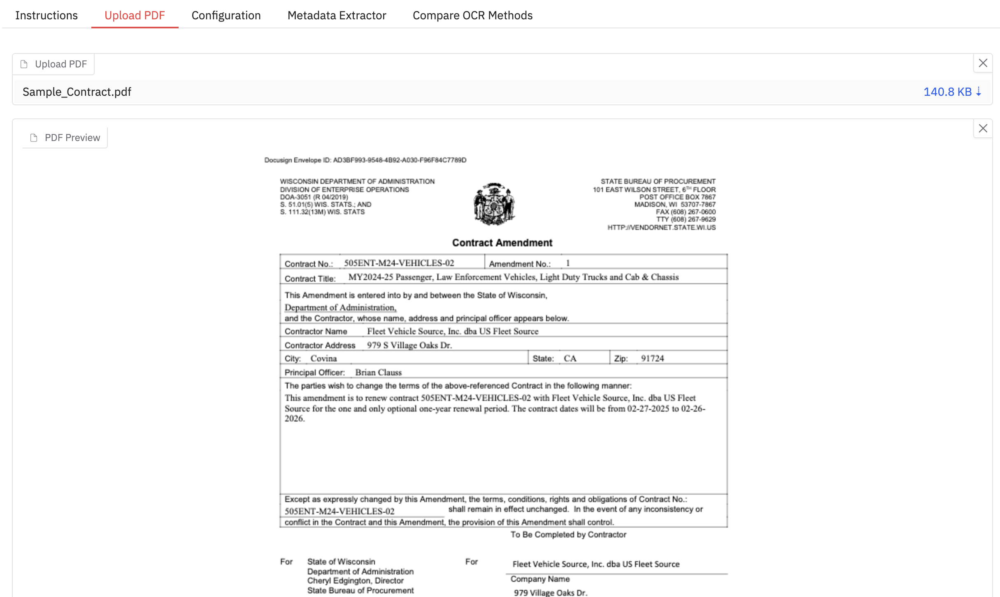
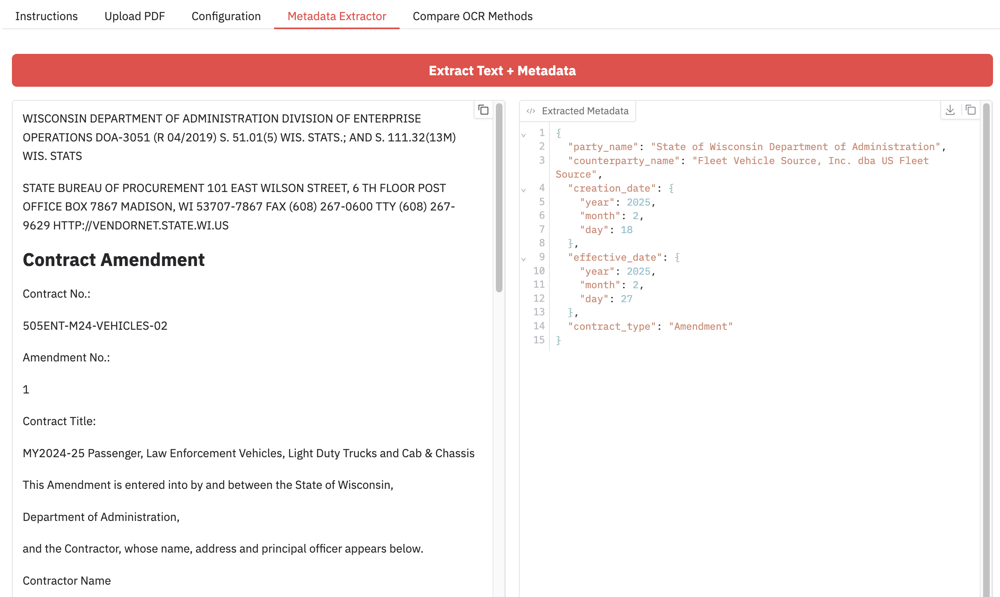

# Metadata Extraction Demo

Demo showcasing metadata extraction from PDFs using a combination of Docling and LLMs

## Table of Contents

- [Metadata Extraction Demo](#metadata-extraction-demo)
  - [Table of Contents](#table-of-contents)
  - [Features](#features)
  - [Getting Started](#getting-started)
    - [Prerequisites](#prerequisites)
    - [Initial Steps](#initial-steps)
      - [Option 1. Entirely Local Setup](#option-1-entirely-local-setup)
      - [Option 2. Setup With Remote LLM (vLLM, OpenAI, etc.) and/or Docling Server](#option-2-setup-with-remote-llm-vllm-openai-etc-andor-docling-server)
  - [Run the Demo Locally](#run-the-demo-locally)
  - [Run the Demo with Docker/Podman](#run-the-demo-with-dockerpodman)
  - [Acknowledgments](#acknowledgments)

## Features

**Bring Your Own PDF**


**Specify Your Models and Structure**


**Get Extracted Markdown and Metadata**


**Compare OCR Methods**


## Getting Started

### Prerequisites

In order to work on this project, the following tools *must* be installed:

- [`uv`](https://docs.astral.sh/uv/getting-started/installation/)

### Initial Steps

To begin working on this project:

1. Clone the repository to your local system via `git clone`
2. Change directory to the project `cd metadata_extraction_demo`
3. Make a copy of `sample.env` and rename it as `.env`
4. Install the project dependencies `uv venv && uv sync`
   - If running on Mac, you can install optional dependencies for Mac with `uv sync --extra mac`
5. Choose one of the following paths depending on your environment:

#### Option 1. Entirely Local Setup

1. Install [Ollama](https://ollama.com/), [vLLM](https://docs.vllm.ai/en/latest/getting_started/installation/), [llama.cpp](https://github.com/ggml-org/llama.cpp/blob/master/docs/install.md), or any local OpenAI-compatible server.
2. Download a model, e.g. `ollama pull qwen2.5`
3. Add/replace the following environment variables in `.env`:

  ```sh
  OPENAI_BASE_URL="http://localhost:11434/v1"
  OPENAI_API_KEY="NONE"
  ```

#### Option 2. Setup With Remote LLM (vLLM, OpenAI, etc.) and/or Docling Server

1. Add/replace the following environment variables in `.env`:

  ```sh
  # Remote LLM
  OPENAI_BASE_URL="https://your.example-llm-url.com/v1" # Remove if using OpenAI
  OPENAI_API_KEY="<KEY>"
  # OPENAI_IGNORE_SSL=True # Optional: Disable SSL verification for remote server

  # (Optional) Remote Docling Server
  DOCLING_BASE_URL="https://your.example-docling-url.com"
  DOCLING_API_KEY="<KEY>"
  ```

## Run the Demo Locally

To start the demo locally, run:

```sh
uv run gradio metadata_extraction_demo/app.py
```

You can access the application at [http://localhost:7860](http://localhost:7860).
Once the application is running, you can see usage instructions on the Instructions tab.
You can also see this information in [INSTRUCTIONS.md](./INSTRUCTIONS.md).

## Run the Demo with Docker/Podman

_This option requires that you have either [Podman](https://podman.io/) or [Docker](https://www.docker.com/) installed on your system.*

1. Run

    ```bash
    podman build -t metadata-extraction-demo .
    podman run --rm -d \
        -p 7860:7860 \
        -e OPENAI_BASE_URL=http://host.docker.internal:11434/v1 \
        --name metadata-extraction-demo \
        -it metadata-extraction-demo
    ```

- If you're using Docker, simply replace `podman` with `docker` in the above command.
- You can modify the environment variables as needed depending on your deployment configuration.
- Access the application at [http://localhost:7860](http://localhost:7860).

> [!WARNING]  
> Docling OCR does not perform well on Mac in containers. If you are using Mac, consider running the demo locally, not forcing full page OCR, or using remote Docling instead. See [#1121](https://github.com/docling-project/docling/issues/1121).

## Acknowledgments

The [contract](https://vendornet.wi.gov/Contract.aspx?Id=dfa85fb8-c9d5-ee11-904e-00505684483d) used in the demo is a publicly available PDF provided by Wisconsin State's [VendorNet](https://vendornet.wi.gov/).
